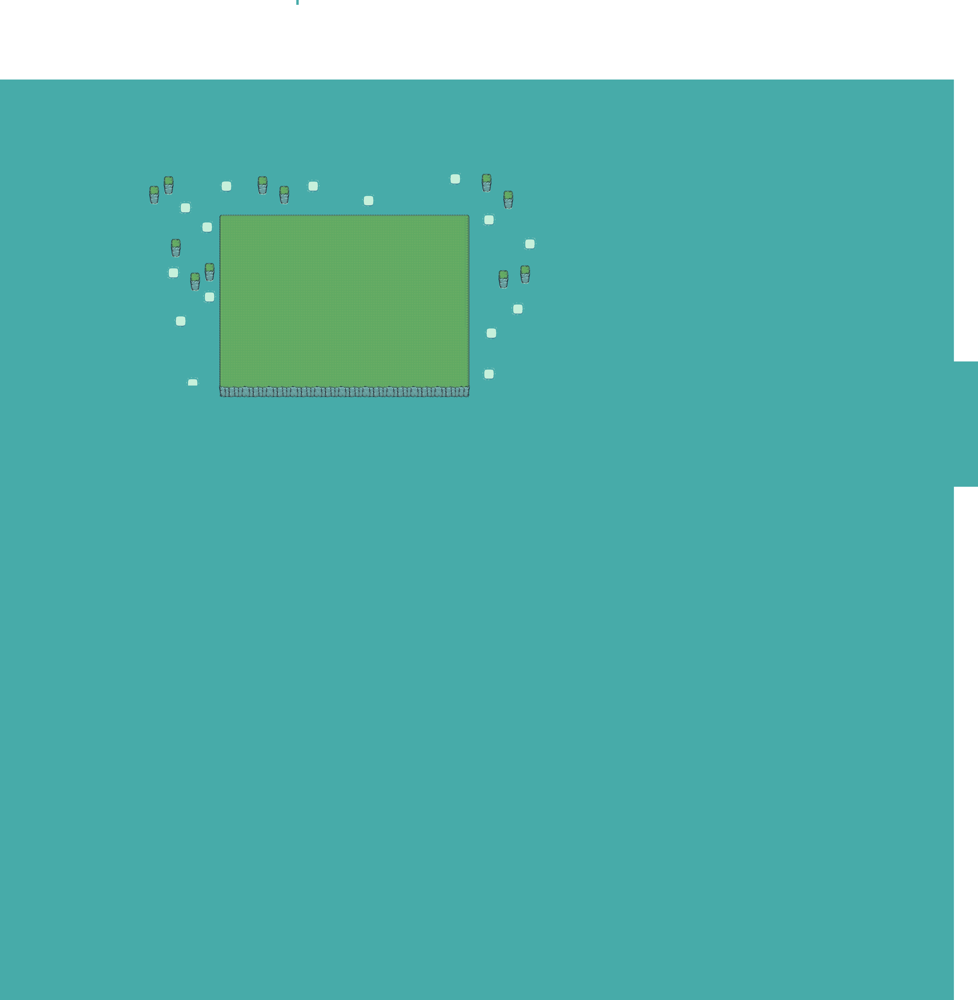

# 🏰 TinySwords - Survivors-Like RPG

A browser-based 2D action RPG built with Phaser 3, featuring wave-based combat, AI allies, and ability progression. Survive waves of enemies spawning from the castle gate!



**Status:** 🚧 In Development - Phase 1, 2, 3 Complete  
**Play Now:** `cd game && npm run dev` → http://localhost:3000/

---

## 🎮 Current Features (v0.3.0)

### Core Gameplay
- **Single Hero:** Play as the Warrior with melee combat and guard ability
- **Wave Survival:** Survive 5 progressively difficult waves
- **Leveling System:** Gain XP from kills, level up to 10 for stat boosts
- **Strategic Combat:** 4-directional attacks, guard ability (50% damage reduction)
- **Dynamic Spawns:** Enemies spawn from the castle gate in focused patterns

### AI Allies (NEW - Phase 2)
- **Ally Warriors (Blue):** Melee fighters that auto-engage enemies within 200px
- **Ally Monks (Blue):** Healers that follow you and auto-heal when wounded
- **Smart AI:** Allies follow you, detect enemies, and return when targets are lost
- **Visual Distinction:** Blue units contrast with your black warrior and red enemies

### Interactive Buildings (NEW - Phase 3)
- **6 Interactive Buildings:** 4 Houses + 2 Towers across the island
- **Press E to Spawn:** Houses spawn warriors, towers spawn monks
- **20-Second Cooldown:** Strategic timing for ally spawning
- **Visual Feedback:** Proximity prompts, cooldown bars, particle effects
- **Survivors-Like Gameplay:** Build your army as you progress!

### Progression
- **XP Rewards:** +50 XP (warriors), +30 XP (archers)
- **Level Benefits:** +20 HP, +5 damage per level
- **Full Heal:** Restore to full health on level up

### Environment
- **Pixel-Perfect Collision:** Stay on the green island
- **Interactive Buildings:** Walk near and press E to spawn allies
- **Visual Feedback:** Floating damage/heal numbers, level-up effects, building prompts
- **Professional UI:** DOM-based health and XP bars, cooldown timers

---

## 🕹️ Controls

| Key | Action |
|-----|--------|
| **WASD** | Move in all directions |
| **SPACE** | Attack (direction based on movement) |
| **SHIFT** | Guard (50% damage reduction) |
| **E** | Interact with buildings (spawn allies) |
| **R** | Restart game (after death/victory) |

---

## 🚀 Quick Start

### Prerequisites
- Node.js (v16+)
- npm

### Installation & Run

```bash
# Clone repository
git clone https://github.com/SchwenderOne/TinySwords.git
cd TinySwords

# Install dependencies
cd game
npm install

# Start development server
npm run dev
```

Open browser to **http://localhost:3002/**

### Production Build

```bash
npm run build
```

Built files will be in `game/dist/`

---

## 🎯 Gameplay

### Objective
Survive 5 waves of enemies spawning from the castle gate!

### Wave Progression
```
Wave 1: 3 enemies  (2 warriors, 1 archer)
Wave 2: 5 enemies  (3 warriors, 2 archers)
Wave 3: 7 enemies  (4 warriors, 3 archers)
Wave 4: 9 enemies  (5 warriors, 4 archers)
Wave 5: 11 enemies (6 warriors, 5 archers)
```

### Enemy Types
- **Red Warriors:** Melee attackers, patrol and chase (100 HP, 10 damage)
- **Red Archers:** Stationary ranged units (60 HP, 8 damage, 400px range)

### Ally Types
- **Blue Warriors:** Melee allies, auto-engage enemies (80 HP, 12 damage)
- **Blue Monks:** Healer allies, auto-heal player when wounded (60 HP, 20 heal)

### Strategy Tips
- **Early Game:** Spawn allies from buildings before waves get harder
- **Building Cooldowns:** 20 seconds each - plan your spawns strategically
- **Ally Mix:** Get at least one monk for healing, rest warriors for DPS
- **Positioning:** Keep moving, allies will follow and assist automatically
- **Guard Usage:** Use SHIFT when surrounded, even with allies
- **Health Management:** Monks auto-heal + 30% potion drops = survivability
- **Leveling:** Level up fully restores health and boosts stats

---

## 🛠️ Technology Stack

- **Engine:** Phaser 3.90.0
- **Build Tool:** Vite 5.0 (fast HMR)
- **Language:** JavaScript ES6+
- **UI:** Hybrid Canvas + DOM overlay
- **Physics:** Arcade (top-down, no gravity)

---

## 📁 Project Structure

```
game/
├── src/
│   ├── config/
│   │   └── GameBalance.js        # Centralized game configuration
│   ├── entities/
│   │   ├── BaseCharacter.js      # Shared character logic
│   │   ├── Player.js             # Warrior implementation
│   │   ├── AllyCharacter.js      # AI ally base class
│   │   ├── AllyWarrior.js        # Blue warrior ally
│   │   ├── AllyMonk.js           # Blue monk healer
│   │   ├── InteractiveBuilding.js # Building interaction system
│   │   ├── Enemy.js              # AI opponents
│   │   └── HealthPotion.js       # Collectible items
│   ├── scenes/
│   │   ├── BootScene.js          # Asset loading
│   │   └── GameScene.js          # Main game loop
│   └── utils/
│       ├── CollisionMap.js       # Terrain detection
│       ├── FloatingText.js       # Visual feedback
│       └── UIBars.js             # Health/XP bars
└── public/assets/                # Sprites, map, buildings

Assets/                         # Source art files
├── Units/                      # Character sprites
├── Buildings/                  # Structures
├── Decorations/               # Trees, bushes, rocks
└── Terrain/                    # Tilemap assets
```

---

## 🚧 Upcoming Features

### Phase 4: Ability System (Next)
- Unlock powerful abilities at levels 3, 5, 8, 10
- Power Slash, Whirlwind, Battle Charge, Titan Strike
- Number key bindings (1-4)
- Slash effect animations

### Phase 5: Enemy Tuning
- Balance difficulty with ally support
- Adjust enemy counts and stats
- Test wave progression

### Phase 6: Meta Progression
- Persistent upgrades across runs
- Currency system for permanent buffs
- Post-run summary screen

See `ROADMAP.md` for detailed development plan.

---

## 🎨 Assets

This game uses the TinySwords pixel art asset pack:
- 4 color factions (Black, Blue, Red, Yellow)
- Multiple unit types (Warrior, Monk, Archer, Lancer)
- Buildings, decorations, terrain tiles
- 6496×6640px island battlefield

Additional assets:
- Health Bar Asset Pack 2 by Adwit Rahman
- Free Slash Effects Sprite Pack by Craftpix

---

## 🐛 Known Issues

**None currently.** All critical bugs have been fixed.

Report issues on GitHub or see `CURRENT_STATE.md` for development status.

---

## 🤝 Contributing

Contributions welcome! Please:
1. Check `CURRENT_STATE.md` for current implementation
2. Read `TARGET_SPEC.md` for end goals
3. Follow existing code patterns (BaseCharacter, GameBalance)
4. Test thoroughly before submitting PR

---

## 📝 Development Documentation

For developers and AI assistants:
- **CURRENT_STATE.md** - Exact current implementation
- **TARGET_SPEC.md** - End goals and vision
- **ROADMAP.md** - Development phases and tasks
- **.cursor/CONTEXT.md** - AI assistant quick reference

---

## 📄 License

Game assets from TinySwords asset pack - check asset license for usage rights.  
Game code: MIT License

---

## 🙏 Acknowledgments

- TinySwords asset pack creators
- Health Bar Asset Pack 2 by Adwit Rahman
- Phaser.js community
- [Phaser Documentation](https://phaser.io/docs)

---

## 📮 Contact

Created by [@SchwenderOne](https://github.com/SchwenderOne)

---

**Current Version:** v0.3.0  
**Last Updated:** October 17, 2025  
**Status:** ✅ Phase 1, 2, 3 Complete → 🚧 Phase 4 Next
